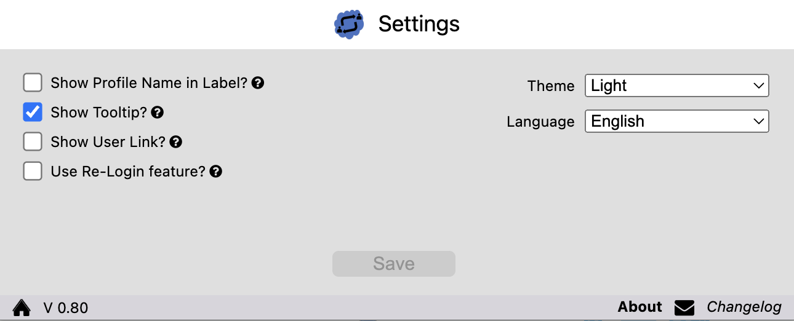
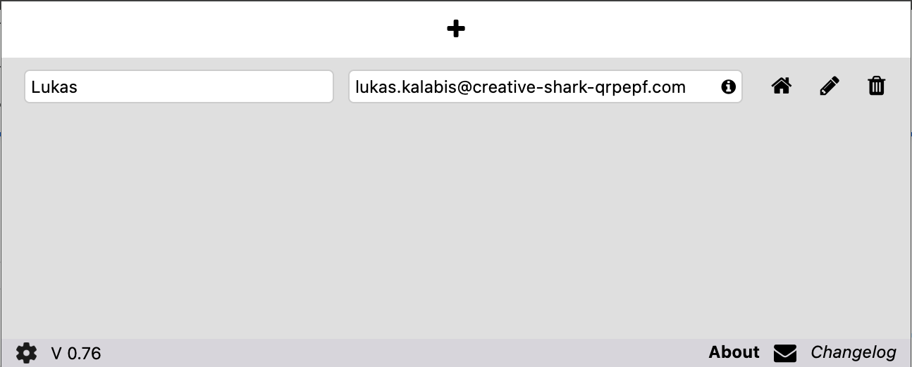
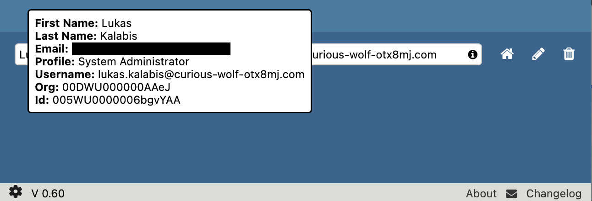
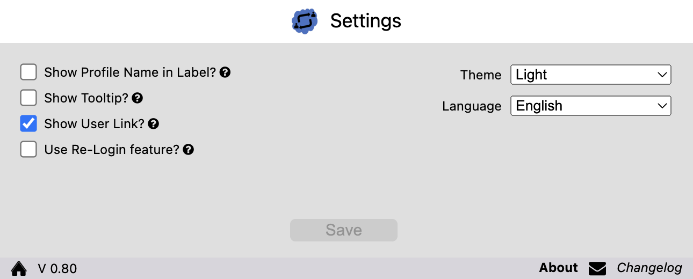

# Documentation

## Settings

Since version **0.6** different settings are availalbe for the SF-User-Switcher.

In order to access the settings, click on the 'gear' icon in the left bottom corner.

### <a name="relogin">Re-Login

**If you come from a version before 0.6\* you have to activate this feature in the settings first.**

If this feature is active you can Re-Login into an other user via the plugin wihtout the need to logout first. This will be handled by the plugin itself.
If you select this feature you can additionally specify the time (in milliseconds). The value **must be** between 500 and 10.000.
The default value is 1.000 and you can keep it this way.

As we all know from the 'normal' Login-As process, the login, as well as the re-login may fail. As far as I can say it this is not related to the plugin, but to the
Salesforce platform itsself.

#### Errors that may occur

During my tests I found the following error cases:

1. The user clicks on the 'Login' button, a new tab opens, but the page is not loaded.
    - In this case just close the tab and try login again.
2. The user clicks on 'logout' while logged in as another user. Suddenly the user is logged out completly from Salesforce.
    - In this case you have to login as your user again.

If you have the feeling that this feature is not working as expected, please deactivate it in the settings and write me a message with the error case.

### <a name="labels">Profil Name in Label

If this feature is active you can see the profile name in the label of the user record.

### <a name="tooltips">Tooltips

If this feature is active you can see a small 'info' icon next to the username.

If the mouse is on the 'info' element you can see additional information related to the user record.

### <a name="userLink">Link to User Record

If this feature is active you can see a small 'user' icon next to the username.

If you click on the 'user' element you will be redirected to the user record in Salesforce.

