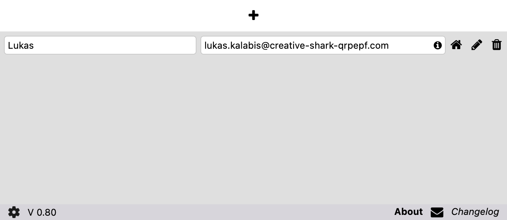
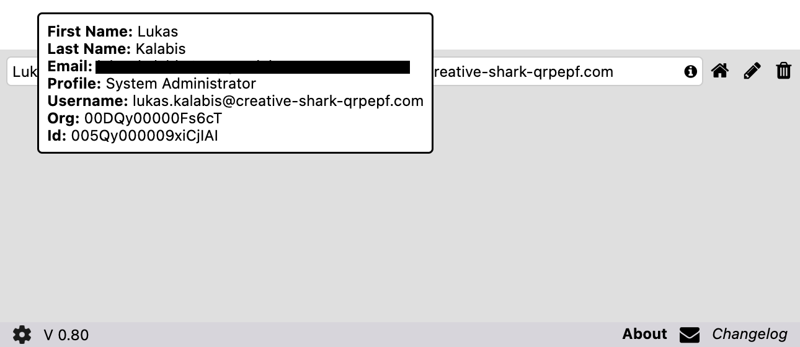

# Documentation

## Settings

Since version **0.6** different settings are availalbe for the SF-User-Switcher.

### <a name="labels">Profil Name in Label

### <a name="tooltips">Tooltips

If the mouse is on the 'info' element you can see additional information related to the user record.

### <a name="relogin">Re-Login

If this feature is active you can Re-Login into an other user via the plugin wihtout the need to logout first.
If you select this feature you can additionally specify the time (in milliseconds). The value **must be** between 500 and 10.000.
The default value is 1.000 and you can keep it this way.

[back](./)
